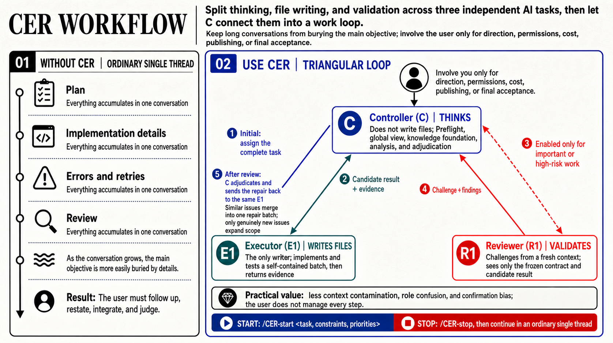

# CER Workflow

[繁體中文](README.md)

CER Workflow gives long-running, multi-batch, or high-risk AI work clear responsibilities, one writer, and a verifiable return loop.

You give the goal, constraints, and priorities to the `🚀 C:` Controller. C clarifies the task and acceptance before sending real work to the same persistent `E1:` Executor. A fresh `R1:` Reviewer is created only when risk needs independent challenge. C returns to you for real direction decisions, missing input, blockers, and acceptance.



## Install Or Upgrade With One Prompt

Paste this into Codex:

```text
Install or upgrade the English CER Skill for Codex. Handle only skills/cer-workflow-en; do not install another language or another agent version. Use the `skills` CLI and follow its upstream documentation:
1. Run `npx skills ls -g -a codex` first, then read back the actual global install path, source, and available `skills` CLI metadata.
2. If `cer-workflow-en` is recognized by the `skills` CLI, run: npx skills update cer-workflow-en --global --yes
3. If `cer-workflow-en` is not recognized and no target-file conflict exists, run: npx skills add Adamchanadam/cer-workflow --skill cer-workflow-en --agent codex --global --yes
4. If files already exist at the target path but the `skills` CLI does not recognize or manage them, do not silently overwrite, delete, or migrate them with --yes. First report the actual path, source evidence, current state, and migration impact, then wait for my explicit confirmation.
5. Read back the source URL, skill path, installed `VERSION`, and install state after completion.
6. Do not start CER automatically. Wait for my explicit CER command.
```

This flow follows the Vercel Labs [`skills` CLI upstream README](https://github.com/vercel-labs/skills/blob/main/README.md). The Codex global install location should be taken from the canonical/global location reported by the `skills` CLI plus actual path and source readback; current CLI evidence can report `~/.agents/skills/`, while Codex may also have an agent-native `~/.codex/skills/` copy. Management by the `skills` CLI must be determined from `skills ls` / `skills update` recognition and readable source / metadata where available, not from the path alone.

The Traditional Chinese and English Skills are Codex-only, complete, and independently installable packages. A Claude Code version would be a separate Skill and has not been provided; this repository does not currently claim Claude Code support. Detailed operating procedure lives only in each package's `references/`.

Bear-card package versions come only from the installed Skill's `VERSION`, currently `0.2.1`; updating the whole Skill naturally supplies the next value. A missing, unreadable, or malformed value renders `version unverified` instead of guessing from the workflow generation or network data.

## Start CER

After installation, use an explicit CER-qualified command:

```text
Start CER: <goal, constraints, priorities>
```

or:

```text
/CER-start <goal, constraints, priorities>
```

A plain start/work message does not start CER. It remains available to the workspace's existing workflow.

## Commands

| Command | Natural language | Use |
|---|---|---|
| `/CER-start <task, constraints, priorities>` | `Start CER: ...` | Start CER. |
| `/CER-stop` | `Stop CER and continue in a single thread.` | Leave CER mode; send no new E1/R work, but do not claim the task is complete. |
| `/CER-close` | `Close CER.` | Formally close CER; confirm the result, remaining work, and the same E1's `writer closed` state. |
| `/CER-status` | `Show CER status.` | Show known state, role coordinates, next checkpoint, and blockers without polling. |
| `/CER-help` | `Show CER commands.` | Show the available commands. |

A plain close/finish message does not close CER and is not treated as `/CER-stop`.

## How CER Works

1. Before real dispatch, C concisely checks the endpoint, sources, boundary, permissions/stops, and acceptance. An unsupported assumption cannot be presented as confirmed.
2. A local task or an explicitly designated Remote task may become the only C. A Remote receiver first returns candidate `C_READY`; only after the sender verifies that no other active C exists, reads the receipt, and returns `C_ACCEPTED` does the receiver become C.
3. C proves task/thread identity, send path, return coordinates, and adjudication point, then receives E1's zero-write `ready`.
4. The same persistent E1 is the only writer. Every batch is self-contained and does not depend on "see above."
5. E1 direct-pushes a candidate to C. C reads back, tests, and adjudicates instead of polling for results.
6. When R finds several issues, C groups findings that share the same cause and user impact, then repairs the whole affected boundary once. A separate scope is opened only for a different cause, different user impact, or a regression caused by the latest repair.

Long-running or multi-batch work uses an inline roadmap to show the endpoint, current position, next checkpoint, and role state. Direction decisions, major blockers, staged results, and final acceptance interrupt the user; ordinary substeps do not display process ceremony.

## CER Compared With One Thread

A normal single thread is faster for one small edit or work you want to guide step by step. CER is for long-running, multi-batch, interruption-prone work that needs one writer or independent challenge proportional to risk.

The trade-off is that CER must prove its communication loop before work starts. Creating a task, changing a title, or sending one message is not enough. Without `ready/result` receipts, CER stops honestly at a blocker.

## Stop Versus Close CER

`/CER-stop` leaves CER mode. Use it when you want to continue in a normal single thread. C sends no new work, and if E1 is writing, C first brings the writer to a verifiable state. It does not claim that the task is finished and does not create a formal CER closeout.

`/CER-close` formally ends this CER run. Use it when the task is complete or you want a final handoff. C converges the result, risks, and remaining work; the same E1 updates only required sources that already exist in the workspace and marks `writer closed`. CER does not create a fixed project document set or a parallel progress source.

## Included

- [`skills/cer-workflow/`](skills/cer-workflow/): Traditional Chinese CER Core v1 Skill
- [`skills/cer-workflow-en/`](skills/cer-workflow-en/): complete English mirror Skill
- [`RELEASE_NOTES.en.md`](RELEASE_NOTES.en.md): English release notes
- [`RELEASE_NOTES.md`](RELEASE_NOTES.md): Traditional Chinese release notes

This repository contains only public, installable CER Core v1 content.
