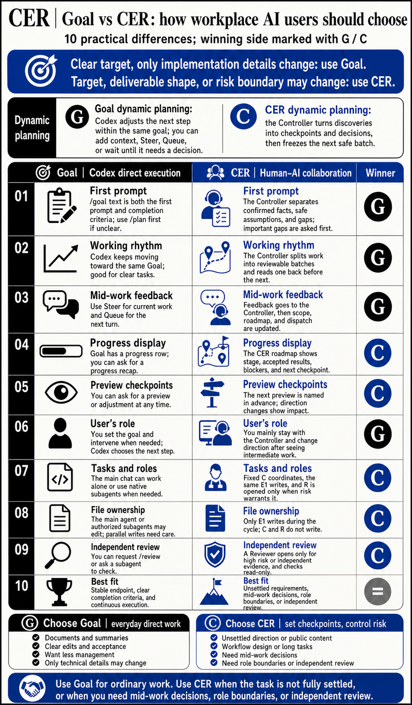
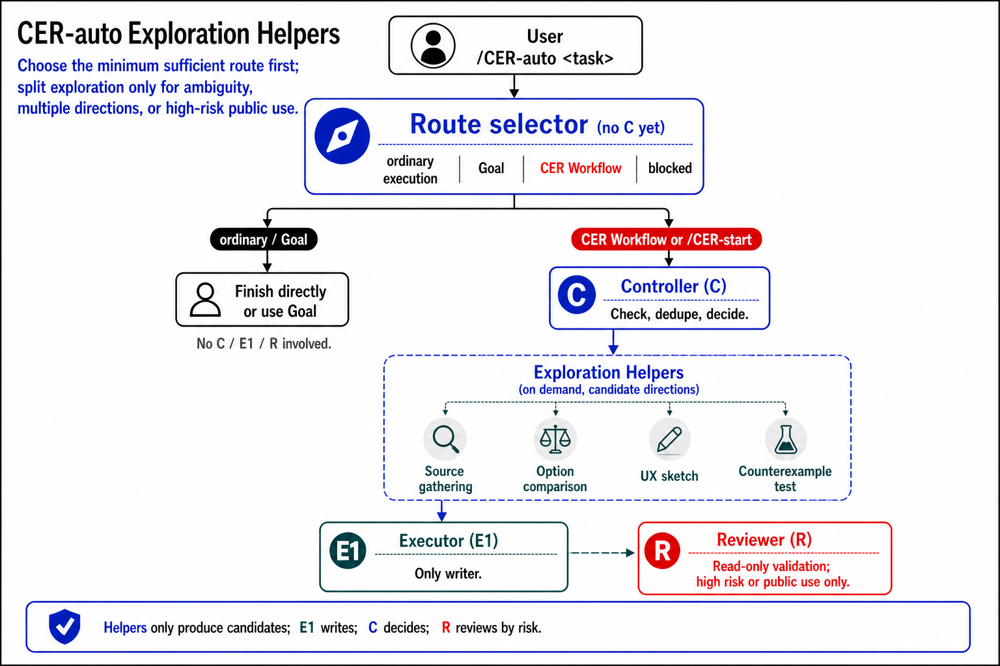

# CER Workflow

[繁體中文](README.md)

CER = Controller, Executor, Reviewer.

CER is a workflow skill for Codex. It does not replace Goal. Use Goal for ordinary work. Use CER when the task is not fully settled, or when you need mid-work decisions, role boundaries, or independent review.

In plain language: when you discover halfway through that the direction, constraints, or risk has changed, CER brings that change back to you before assigning the next batch of work. It is for tasks where the human and the AI need to make decisions together. It is not worth using for every small task.



## Choose First

Use Goal when:

- You are summarizing, organizing documents, making a clear edit, or working toward clear acceptance criteria.
- You know the endpoint, even if implementation details may change.
- You want Codex to keep moving with less management from you.

Use CER when:

- The direction is not fully settled, and the tradeoffs only become clear during the work.
- The work affects public content, workflow design, long-running tasks, or areas where the AI can easily drift from your intent.
- You need mid-work decisions, clear role boundaries, or independent review on important or risky work.

Examples:

- "Turn these meeting notes into a one-page summary": use Goal.
- "Fix the login bug and make the tests pass": use Goal.
- "Redesign the onboarding flow, and show me checkpoints before the direction is locked": use CER.
- "Rewrite the README so non-CER users understand when to use CER instead of Goal": use CER.

## When The Plan Changes During The Work

Goal and CER can both start from a short request. Both let you add information, change constraints, and check progress while the work is running. The difference is how they handle things that only become clear halfway through.

Goal keeps moving inside the same target. You can add context in the same chat, use Steer to change the current work, use Queue for the next turn, or ask for a progress recap. When Codex needs a decision or approval, it pauses and asks. This suits tasks where the target is clear and only the implementation path changes as Codex learns more.

CER puts the new discovery in front of the Controller before the next batch is assigned. The Controller separates what is confirmed, what is only a safe assumption, and what gap would change the result. It only sets the next batch that is safe to run. If a test result, tool response, user correction, or Reviewer finding changes the direction, scope, deliverable shape, or acceptance standard, the Controller updates the roadmap before sending the next batch.

The difference is the working style:

- Goal: the AI adjusts the next step inside the same target.
- CER: the workflow brings result-changing discoveries back for a decision before the next batch.

## Goal And CER: 10 Practical Differences

| # | Point of comparison | Goal | CER | How most users should read it |
|---:|---|---|---|---|
| 1 | First prompt | The `/goal` text becomes both the first prompt and the completion criteria. If the direction is still unclear, you can use `/plan` first. | The Controller separates confirmed facts, safe assumptions, and critical gaps. It asks before delegating when a gap would materially change the result. | Goal is more direct for everyday work. |
| 2 | Working rhythm | Codex keeps moving toward the same Goal, which suits long tasks that need less intervention. | The Controller divides the work into reviewable batches and decides the next batch after reading back the current one. | Use Goal for a clear target; use CER when batches need checkpoints. |
| 3 | Feedback during the work | In the same chat, `Steer` can change the current run and `Queue` can hold a message for the next run. You can also pause or edit the Goal. | You give feedback to the Controller. It identifies the affected scope, updates the roadmap, and sends a new batch to the same Executor. | Goal handles normal added context; CER is clearer when feedback changes direction. |
| 4 | Progress display | The desktop app shows a Goal progress row, and you can ask Codex for a progress recap. | Long or multi-stage work uses a CER roadmap showing the current stage, accepted results, blockers, and the next user checkpoint. | CER is clearer when checkpoints matter. |
| 5 | Previews and checkpoints | You can ask to inspect, explain, or adjust the work at any time. Preview timing usually comes from the prompt or the immediate need. | The roadmap marks points that need a preview or decision. When direction, deliverable shape, or acceptance changes, it shows what changed. | Use CER when you need to see intermediate work before deciding. |
| 6 | Your place in the workflow | You set the Goal and can intervene at any time, while Codex chooses the next step. It pauses when it needs a decision or approval. | You mainly stay in the Controller chat, adding requirements or changing direction after seeing intermediate work. The Controller carries those decisions into the implementation track. | Use Goal when you want less management; use CER when you want clearer decision points. |
| 7 | Task and agent structure | The main chat can work alone or use native, sidebar-visible subagents. Roles and handoffs depend on the task. | Each cycle has a fixed C for coordination and the same E1 for file changes. A fresh, read-only R is created only when risk warrants it. | Use CER when role boundaries and handoff clarity matter. |
| 8 | File ownership | The main agent or a subagent used for the task may make changes. Parallel work must avoid writing to the same source. | Only E1 writes files during a cycle. C and R stay read-only, avoiding concurrent changes from different roles. | Use CER when you want to avoid multiple roles writing at once. |
| 9 | Independent review | You can request a review, such as `/review`, or ask a subagent to check the work, but it is not a fixed part of every Goal. | A fresh R is used only for important, high-risk work or when independent evidence is needed. C groups the findings and returns them to the same E1. | Use CER for risky or public deliverables. |
| 10 | Best fit | The endpoint is stable, the completion criteria can be stated clearly, and you want Codex to carry the work through continuously. | The task is not fully settled, or it needs mid-work decisions, role boundaries, or independent review. | Neither replaces the other; choose by task. |

The Goal details above follow OpenAI's [Long-running work](https://learn.chatgpt.com/docs/long-running-work), [Prompting](https://learn.chatgpt.com/docs/prompting), and [Subagents](https://learn.chatgpt.com/docs/agent-configuration/subagents) documentation. The CER details follow this repo's [Controller Preflight](skills/cer-workflow-en/references/core-runtime.md#controller-preflight), [Execution Loop](skills/cer-workflow-en/references/core-runtime.md#execution-loop), and [inline roadmap](skills/cer-workflow-en/references/roadmap.md#two-different-surfaces).

## CER Roles


**Controller (C): coordination and decisions**

Understands the goal, constraints, and completion criteria; assigns work and judges results. The Controller does not modify project files.

**Executor (E1): implementation and file changes**

The only role that modifies files. It implements in batches, tests, and returns candidate results with evidence. The same E1 stays in use throughout one CER cycle, so file changes do not come from several roles at once.

**Reviewer (R1): independent review**

An independent Codex task that checks in read-only mode, gives conclusions, and does not write files. It is used only for important or high-risk work, or when independent verification is needed.

Sidebar labels such as `C:01`, `E1:01`, and `R1:01` mark the roles in the same CER cycle.

## Advanced: Exploration Helpers

Exploration Helpers are not a fourth formal role. The formal roles remain Controller, Executor, and Reviewer.

Medium and large tasks sometimes need several kinds of preparation at once: finding information, comparing options, sketching interface directions, or spotting likely risks. If the Controller handles all of that one item at a time, the early analysis can slow down the workflow. When it is useful, the Controller may start a small number of Exploration Helpers to organize candidate information before the Controller checks, deduplicates, and decides.

Exploration Helpers only produce candidate material. They do not modify the project, replace the Executor or Reviewer, or declare the work complete. The Controller decides whether to start them based on task size, source clarity, and whether parallel preparation is actually useful. The complete conditions live in the [complete Exploration Helper rules](skills/cer-workflow-en/references/parallel-producers.md#activation-eligibility).



## Install Or Upgrade

Paste this into Codex:

```text
Use the skills CLI to install or upgrade the English CER Skill for Codex: skills/cer-workflow-en from https://github.com/Adamchanadam/cer-workflow. If an existing install is managed by the CLI, upgrade it. If it is not installed, install it. If files already exist at the target location but the CLI cannot confirm it can manage them, stop and report before overwriting or deleting anything. When finished, read back the install path, source, and VERSION. Stop there; do not start CER. Wait for my separate CER command.
```

## Start CER

After installation, use an explicit CER command:

```text
Start CER: <goal, constraints, priorities>
```

or:

```text
/CER-start <goal, constraints, priorities>
```

A plain start/work message does not start CER. It remains available for your usual way of working.

## Commands

| Command | Natural language | Use |
|---|---|---|
| `/CER-start <task, constraints, priorities>` | `Start CER: ...` | Start CER, with the Controller coordinating the work. |
| `/CER-stop` | `Stop CER and continue in one ordinary conversation.` | Stop using CER and stop assigning new Executor or Reviewer work; this does not mean the task is complete. |
| `/CER-close` | `Close CER.` | Formally end this CER cycle; summarize the result, risks, and remaining work. |
| `/CER-status` | `Show CER status.` | Show current progress, the next stopping point, and known issues. |
| `/CER-help` | `Show CER commands.` | Show the available commands. |

A plain close/finish message does not close CER and is not treated as `/CER-stop`.

## How CER Works

1. You give the task to the Controller, including the goal, constraints, and priorities.
2. The Controller confirms the completion criteria, sources, and stopping points, then sets only the next batch that is safe to run.
3. The Executor changes files, tests the work, and returns candidate results with evidence to the Controller.
4. For important or risky work, the Controller asks the Reviewer to perform an independent read-only check.
5. The Controller groups issues, decides what should be fixed, and returns the result, risks, and decisions that need you.

Issues with the same cause are grouped into one batch and sent back to the same Executor. The scope widens only for a different problem, a new effect, or a new risk.

When CER starts, it first confirms that the working tasks can return messages to each other. If that cannot be confirmed, CER stops and tells you instead of pretending it has started.

## Stop Versus Close CER

`/CER-stop` stops using CER and returns to one ordinary conversation. It means the Controller will not assign new Executor or Reviewer work; it does not mean the task is complete.

`/CER-close` formally ends this CER cycle. The Controller summarizes the result, risks, and remaining work, and confirms that the Executor has stopped writing. After close, the old C/E/R tasks are history only; the next cycle uses new role tasks.

## Included

- [`skills/cer-workflow/`](skills/cer-workflow/): Traditional Chinese CER Skill
- [`skills/cer-workflow-en/`](skills/cer-workflow-en/): English CER Skill
- [`RELEASE_NOTES.en.md`](RELEASE_NOTES.en.md): English release notes
- [`RELEASE_NOTES.md`](RELEASE_NOTES.md): Traditional Chinese release notes

This repository contains only public, installable CER Skill content.
