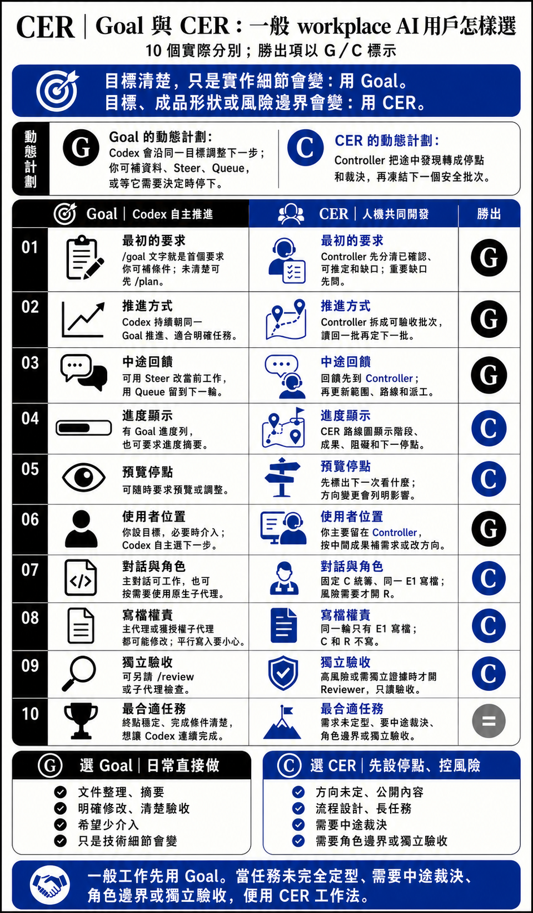
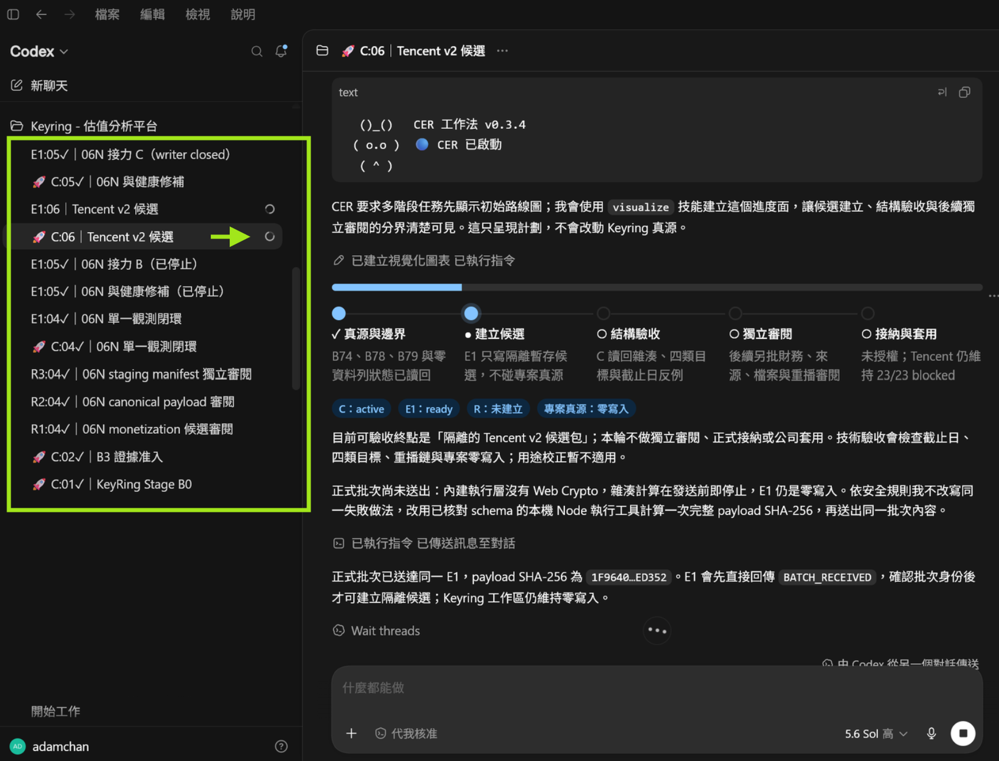
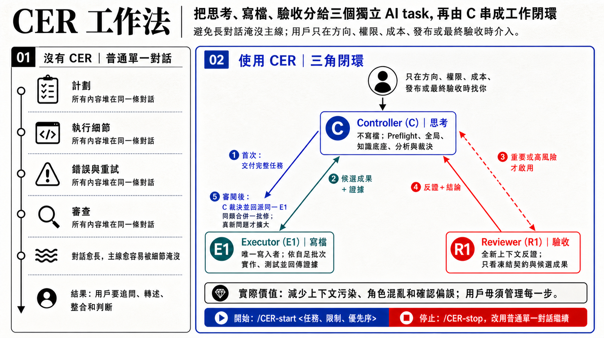
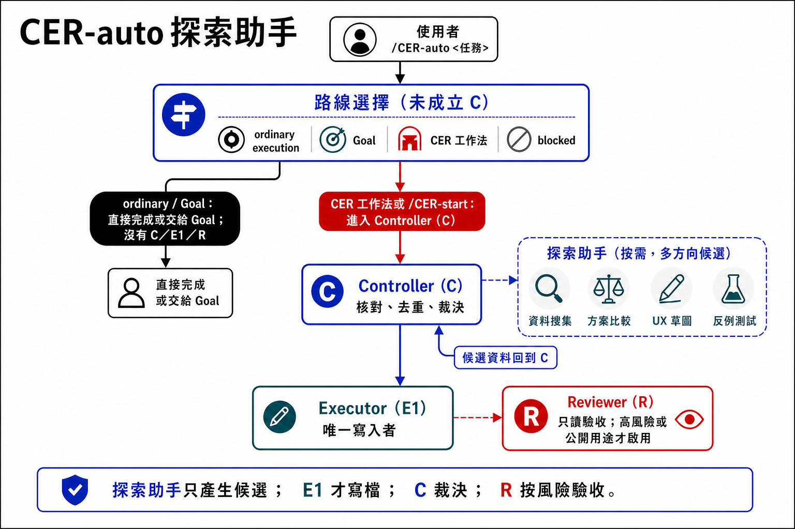

# CER 工作法

[English](README.en.md)

CER = Controller、Executor、Reviewer。

CER 是給 Codex 用的工作法 Skill。它不取代普通對話，也不取代 Goal。小任務用普通對話；需要 Codex 持續跑多步、而終點清楚時，用 Goal；當任務未完全定型、需要中途裁決、角色邊界或獨立驗收，便用 CER 工作法。

簡單說：如果做到一半才發現方向、限制或風險變了，CER 會先把這件事放到你面前決定，再安排下一批工作。它適合人和 AI 一起做判斷的任務，不適合每件小事都開一套流程。



## CER 啟動後看到什麼

CER 開始後，Controller 會先顯示小熊啟動卡和路線圖。左邊的多個 task 會用 C／E1／R 命名，方便你知道哪個負責統籌、哪個負責寫檔、哪個只讀驗收；中間的 inline roadmap 會標出目前階段、已確認內容和下一個停點。



## 先怎樣選

普通對話即可：

- 一次性摘要、翻譯、格式整理、小修小改。
- 你只需要一個短結果，不需要 Codex 長時間持續工作。

用 Goal：

- 任務要跑多步，但終點和完成條件清楚。
- 例如清楚範圍的重構、升級、測試修復。
- 你知道終點，只是實作細節可能會變。
- 你想讓 Codex 少打擾你，自己持續完成。

用 CER：

- 方向未完全定型，做途中才知道取捨。
- 公開內容、流程設計、長任務，或容易做偏的任務。
- 需要中途裁決、清楚角色邊界，或高風險時要獨立驗收。

例子：

- 「把這份會議紀錄整理成一頁摘要」：普通對話即可。
- 「把一段英文改成繁體中文，保持原意」：普通對話即可。
- 「把專案升級到新版框架，保留現有功能，修好相容性問題並跑測試」：用 Goal。
- 「按已寫好的規格完成 CSV 匯入功能，補測試，做到 CI 通過」：用 Goal。
- 「設計一套給客服同事使用的內部知識庫流程；做到一半要看分類、權限和使用方式是否合適」：用 CER。
- 「重做公開產品說明頁；文案、截圖、風險聲稱和驗收標準可能要看第一版後才決定」：用 CER。

改 README 本身不是 CER 任務。只有當公開定位、雙語圖文、發布影響、交接或獨立驗收同時成為重點時，才需要考慮 CER。

## 當計劃途中改變時

Goal 和 CER 都可以從簡短要求開始，也都容許你途中補資料、改限制和查看進度。分別在於它們怎樣處理「做到一半才知道」的事。

Goal 的做法是沿同一個目標繼續推進。你可以在同一對話補資料、用 Steer 改當前工作、用 Queue 留到下一輪，也可以要求進度摘要。當 Codex 需要決定或批准時，它會停下來問你。這適合「目標清楚，只是技術做法要按現場情況調整」的任務。

CER 的做法是把途中發現拿出來判斷。Controller 會分清哪些已確認、哪些只是合理推定、哪些缺口會改變成品；然後只先定好下一批可以安全做的工作。若新的測試結果、工具反應、用戶回饋或 Reviewer 證據會改變方向、範圍、交付形狀或驗收方式，Controller 先更新路線圖，再安排下一批。

差別不在誰比較會做，而在工作方式：

- Goal：AI 在同一目標內自己調整下一步。
- CER：先把會改變結果的發現拿回來決定，再做下一批。

## Goal 與 CER：10 個實際分別

| # | 比較點 | Goal | CER | 一般用戶怎樣看 |
|---:|---|---|---|---|
| 1 | 最初的要求 | `/goal` 的文字同時是首個要求和完成條件；方向仍模糊時，可先用 `/plan` 釐清。 | Controller 先分清已確認內容、安全假設和關鍵缺口；缺口會明顯改變成品時，先問清楚再派工。 | 小任務普通對話即可；多步而終點清楚才用 Goal。 |
| 2 | 推進方式 | Codex 持續朝同一 Goal 推進，適合較少介入的長任務。 | Controller 把工作拆成可驗收批次，讀回一批後再決定下一批。 | 目標清楚用 Goal；批次要停點用 CER。 |
| 3 | 中途回饋 | 可在同一對話用 `Steer` 改變當前工作、用 `Queue` 留待下一輪，亦可暫停或修改 Goal。 | 你把回饋留給 Controller；Controller 判斷受影響範圍、更新路線圖，再把新批次交回同一 Executor。 | 補資料用 Goal 已足夠；改方向用 CER 較清楚。 |
| 4 | 進度顯示 | ChatGPT 桌面版會顯示 Goal 進度列；你也可要求 Codex 整理目前進度。 | 長期或多階段任務使用 CER 路線圖，顯示目前階段、已接納成果、阻礙和下一個使用者停點。 | 需要固定停點時 CER 較清楚。 |
| 5 | 預覽與停點 | 可隨時要求查看、解釋或調整；何時預覽通常由最初的要求或當下需要決定。 | 路線圖預先標出需要預覽或裁決的停點；方向、交付形狀或驗收改變時會顯示差異。 | 要先看中間成果才決定，用 CER。 |
| 6 | 使用者在流程中的位置 | 你設定 Goal 並可隨時介入，Codex 自主選擇下一步；需要決定或批准時會停下來。 | 你主要留在 Controller 對話，按中間成果補需求或改方向；Controller 負責把決定傳到執行線。 | 想少管理用 Goal；想掌握決策點用 CER。 |
| 7 | 對話與角色 | 主對話可自行工作，也可使用側欄可見的原生子代理；角色和交接方式按任務而定。 | 每輪固定由 C 統籌、同一 E1 寫檔；風險需要時才建立全新 Reviewer 做只讀驗收。 | 要固定分工和交接，用 CER。 |
| 8 | 寫檔權責 | 主代理或為任務使用的子代理都可能修改；平行工作須避免寫入同一來源。 | 同一輪只有 E1 寫檔，C 和 R 不寫，避免不同角色同時修改。 | 要避免多角色同時寫檔，用 CER。 |
| 9 | 獨立驗收 | 可另行要求 review（例如 `/review`）或安排子代理檢查，但不是每個 Goal 的固定流程。 | 只有重要、高風險或需要獨立證據時才啟用全新 Reviewer；問題由 C 合併後交同一 E1 修正。 | 高風險或公開交付，用 CER 較穩。 |
| 10 | 最合適的任務 | 終點穩定、完成條件可寫清楚，而且需要 Codex 連續跑多步。 | 任務未完全定型、需要中途裁決、角色邊界或獨立驗收。 | 不是誰取代誰；按任務選。 |

Goal 部分依 OpenAI 官方的 [Long-running work](https://learn.chatgpt.com/docs/long-running-work)、[Prompting](https://learn.chatgpt.com/docs/prompting) 和 [Subagents](https://learn.chatgpt.com/docs/agent-configuration/subagents) 整理。CER 部分以本儲存庫的 [Controller 前置檢查](skills/cer-workflow/references/core-runtime.md#controller-preflight)、[執行閉環](skills/cer-workflow/references/core-runtime.md#執行閉環) 和 [頁內路線圖](skills/cer-workflow/references/roadmap.md#兩種介面) 為準。

## CER 的三個角色



**Controller（C）：統籌與裁決**

理解目標、限制和完成條件，安排工作，判斷結果；不修改專案檔案。

**Executor（E1）：執行與寫檔**

唯一修改檔案；按批次實作、測試、回傳候選成果與證據。同一輪持續使用同一 E1，避免多人同時寫檔。

**Reviewer（R1）：獨立驗收**

獨立 Codex task，只讀檢查、提出結論、不寫檔；只在重要、高風險或需要獨立驗證時啟用。

側欄裡的 `C:01`、`E1:01`、`R1:01` 代表同一輪 CER 的不同角色。

## 進階：探索助手

探索助手不是第四個正式角色。正式角色仍然只有 Controller、Executor、Reviewer。

中大型任務有時需要同時查資料、比較方案、整理介面方向或找出可能風險。這些工作如果全部由 Controller 逐項做，前期分析會慢。這時 Controller 可以按需要啟動少量探索助手，讓它們先整理候選資料，再由 Controller 核對、去重和裁決。

探索助手只產生候選資料；它不修改專案、不代替 Executor 或 Reviewer，也不能宣布工作完成。是否啟動，由 Controller 按任務大小、資料來源是否清楚，以及分頭處理是否真的有用來判斷。完整條件由 [探索助手完整規則](skills/cer-workflow/references/parallel-producers.md#啟動資格) 維護。



## 安裝或升級

把這句交給 Codex：

```text
請使用 skills CLI，為 Codex 安裝或升級繁體中文版 CER Skill：https://github.com/Adamchanadam/cer-workflow 中的 skills/cer-workflow。若既有安裝可由 CLI 管理，請升級；若尚未安裝，請安裝；若目標位置已有檔案但 CLI 無法確認可管理，請先停止並報告，不要覆寫或刪除。完成後請讀回安裝路徑、來源及 VERSION；安裝或升級只到此為止，不要啟動 CER，等我另行輸入 CER 指令。
```

## 開始使用

安裝後，以明確帶 CER 的語句啟動：

```text
CER 啟動：<你想完成的事、限制、優先順序>
```

或：

```text
/CER-start <你想完成的事、限制、優先順序>
```

單獨 `開工` 不會啟動 CER；它保留給你目前的工作方式。

## 操作指令

| 指令 | 自然語言 | 用途 |
|---|---|---|
| `/CER-start <任務、限制、優先順序>` | `CER 啟動：...`／`CER 開始：...`／`CER 開工：...` | 啟動 CER，由 Controller 統籌後續工作。 |
| `/CER-stop` | `停止 CER，改用普通單一對話繼續。` | 停用 CER，不再安排新的 Executor 或 Reviewer 工作；這不代表任務已完成。 |
| `/CER-close` | `CER 收工。`／`CER 關閉。`／`關閉 CER。` | 正式結束本輪 CER；整理成果、風險和未完成事項。 |
| `/CER-status` | `顯示 CER 狀態。` | 顯示目前進度、下一個停點和已知問題。 |
| `/CER-help` | `顯示 CER 指令。` | 顯示可用指令。 |

單獨 `收工` 不會觸發 CER close，也不會被當成 `/CER-stop`。

## CER 怎樣工作

1. 你把任務交給 Controller，包括目標、限制和優先順序。
2. Controller 確認完成條件、資料來源和停點，只先定好下一批可以安全做的工作。
3. Executor 修改檔案、測試，並把候選成果和證據回給 Controller。
4. 重要或高風險工作，Controller 會交給 Reviewer 做獨立只讀檢查。
5. Controller 合併問題、決定是否修正，最後把成果、風險和需要你決定的事交回來。

同一成因的問題會合併成一批交回同一個 Executor 修正；只有不同問題、新影響或新風險，才會擴大處理範圍。

CER 啟動時會先確認各個工作 task 能互相回傳訊息；若未能確認，會停止並告知，不會假裝已開始。

## 停用和收尾有甚麼分別

`/CER-stop` 是停用 CER，回到普通單一對話。它表示 Controller 不再安排新的 Executor 或 Reviewer 工作，不代表任務已完成。

`/CER-close` 是正式結束本輪 CER。Controller 會整理成果、風險和未完成事項，並確認 Executor 停止寫檔。收尾後，舊 C／E／R 只保留作歷史；下一輪會使用新的角色 task。

## 包含內容

- [`skills/cer-workflow/`](skills/cer-workflow/)：繁中 CER Skill
- [`skills/cer-workflow-en/`](skills/cer-workflow-en/)：英文 CER Skill
- [`RELEASE_NOTES.md`](RELEASE_NOTES.md)：繁中發布說明
- [`RELEASE_NOTES.en.md`](RELEASE_NOTES.en.md)：英文發布說明

本 repo 只提供公開、可安裝的 CER Skill 內容。
